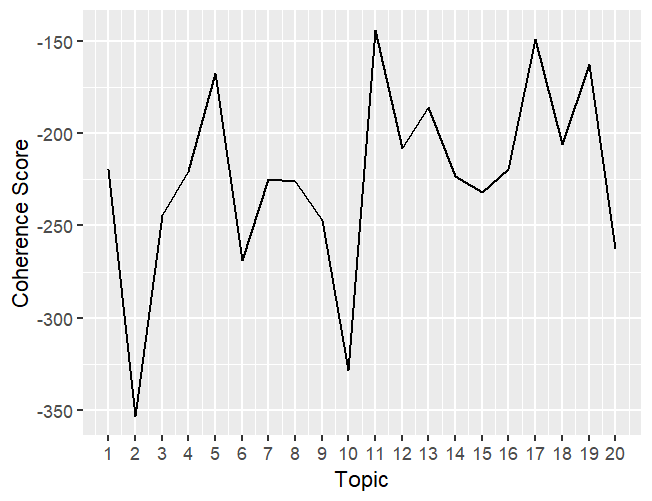
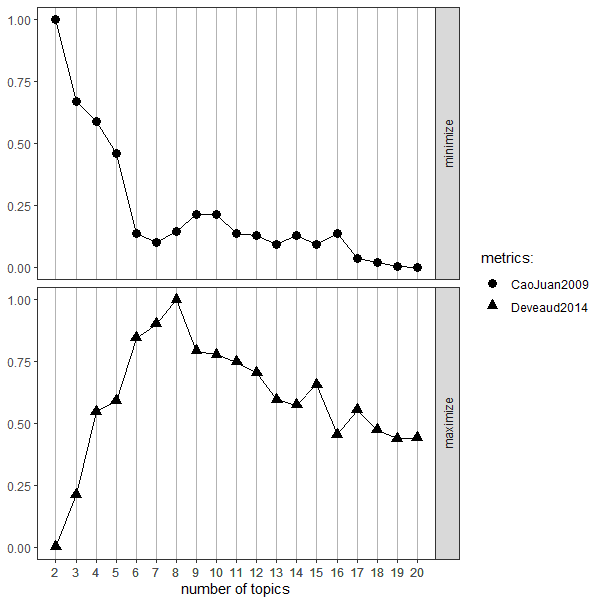

Game Review Analysis with LDA
================
Ellena Nett

# 0. Import Packages

``` r
library(tidytext)
library(dplyr)
library(tibble)
library(quanteda)
library(topicmodels)
library(text2vec)
library(stopwords)
library(quanteda.textstats)
library(lda)
library(tm)
library(textmineR)
library(topicdoc)
library(ggplot2)
library(ldatuning)
library(RColorBrewer)
library(wordcloud)
```

# 1. Load data

Datensatz auf Kaggle:
<https://www.kaggle.com/datasets/georgescutelnicu/hogwarts-legacy-reviews>

``` r
data = read.csv("hogwarts_legacy_reviews.csv")

#head(data)
#View(data)

data = data[,-1] #entferne den ursprünglichen Index; Nummerierung beginnt nun bei 1
data = tibble::rownames_to_column(data, var = "ID")  #Zeilennamen als "ID"-Spalte

df = data %>% select(Review, ID)  #Auswählen der relevanten Spalten für das TM

head(df)
```

    ##                                                                                                                                                          Review
    ## 1                                                                                                                                                 Greattt Game!
    ## 2 9/10Fantastic experience. A true Wizarding World experience. Play it and experience it, the castle alone is the worth it. And thats only a third of the game.
    ## 3                                                                                                                                                      worth it
    ## 4                                                                     I've been waiting 84 YEARSSSSSSSS.The game is everything I could have hoped for and more.
    ## 5                                                                                                                  very fun game (it is not transphobic at all)
    ## 6                                                                                                                   Better than expected! But bad optimization.
    ##   ID
    ## 1  1
    ## 2  2
    ## 3  3
    ## 4  4
    ## 5  5
    ## 6  6

# 2. Preprocessing

``` r
df$Review = gsub('\\p{So}|\\p{Cn}', '', df$Review, perl = TRUE) #Entferne Emojis
#df$Review = gsub('([[:alpha:]])\\1+', '\\1', df$Review) #Entferne wiederholende Buchstaben ("Greattttt game"), aber wie umgehen mit Wörtern mit doppelten Buchstaben?

text_cleaning_tokens = df %>% 
  tidytext::unnest_tokens(word, Review)  #Textspalte als Tokens

text_cleaning_tokens$word = gsub('[[:digit:]]+', '', text_cleaning_tokens$word)  #entferne Zahlen
text_cleaning_tokens$word = gsub('[[:punct:]]+', '', text_cleaning_tokens$word)  #entferne Zeichensetzung


text_cleaning_tokens <- text_cleaning_tokens %>% 
  filter(!(nchar(word) == 1)) %>% 
  anti_join(stop_words)  #herausfiltern von 1-char Zeichen und Stopwörtern

tokens = text_cleaning_tokens %>% 
  filter(!(word=="")) #filtern von leeren Wörtern

tokens = tokens %>% 
  mutate(ind = row_number())  #Zeilennummer als Index

tokens = tokens %>% 
  group_by(ID) %>% 
  mutate(ind = row_number()) %>%
  tidyr::spread(key = ind, value = word)  #Neugruppieren und ID anpassen

tokens [is.na(tokens)] = ""  #ersetze NAs mit leerem String

tokens = tidyr::unite(tokens, Review,-ID,sep =" " )  #Zusammenfassen der Wörter jeder Zeile zu einer Spalte an Text

tokens$Review = trimws(tokens$Review)  #entferne WS an den Rändern

head(tokens["Review"])
```

    ## # A tibble: 6 × 1
    ##   Review                                                                        
    ##   <chr>                                                                         
    ## 1 greattt game                                                                  
    ## 2 games bought recent memory                                                    
    ## 3 contender goty addictive nastalgic worth buy                                  
    ## 4 game peak                                                                     
    ## 5 game explore addicted day played                                              
    ## 6 playing dream true finally received hogwarts letter exploring hogwarts game r…

# 3. Model Building

``` r
corpus = Corpus(VectorSource(tokens$Review))  #konvertiere tokens in corpus


dtm = DocumentTermMatrix(corpus, control = list(minWordLength = 3))  #erstelle eine Document-term-matrix
dtm = DocumentTermMatrix(corpus, control = list(min_word_frequency = 2))

rowSum = apply(dtm , 1, sum)  #Lösung für das Problem mit dem LDA (Fehler: 'empty rows'), Quelle: https://github.com/nikita-moor/ldatuning/issues/6
dtm = dtm[rowSum> 0, ]

#as.matrix(dtm)[1:10,1:5]

num_topics = 20 #baue das Model
lda_model = LDA(dtm, k = num_topics, 
                method = "Gibbs", 
                control = list(seed = 42))
```

## Model optimisation A: coherence score

``` r
coherence_scores = topicdoc::topic_coherence(lda_model, dtm)  #coherence score berechnen

coherence_df = data.frame(topic = 1:num_topics, coherence = coherence_scores)  #umwandeln des coherences scores in einen df für ggplot

ggplot(coherence_df, aes(x = topic, y = coherence)) +
  geom_line() +
  scale_x_continuous(breaks = 1:num_topics) +
  labs(x = "Topic", y = "Coherence Score")  #coherence score für verschiedene Zahl an Topics plotten
```

<!-- -->

## Model optimisation B: CaoJuan und Deveaud

``` r
result_tuningB = ldatuning::FindTopicsNumber(
  dtm,
  topics = seq(from = 2, to = 20, by = 1),
  metrics = c("CaoJuan2009",  "Deveaud2014"),
  method = "Gibbs",
  control = list(seed = 42),
  verbose = TRUE
)
```

    ## fit models... done.
    ## calculate metrics:
    ##   CaoJuan2009... done.
    ##   Deveaud2014... done.

``` r
FindTopicsNumber_plot(result_tuningB)
```

<!-- -->

## Result: Model with 8 Topics

``` r
num_topics_tuned = 8

lda_model_tuned = LDA(dtm, k = num_topics_tuned, 
                      method = "Gibbs", 
                      control = list(seed = 42))

theta = tidy(lda_model_tuned, matrix = "gamma")  #berechne die Wahrscheinlichkeitsverteilung der Themen für jedes Dokument (theta)

phi = tidy(lda_model_tuned, matrix = "beta")  #berechne die Wort-Thema-Wahrscheinlichkeit (phi)
```

# 4. Visualisation

``` r
terms(lda_model_tuned, 10)  #Verteilung der Wörter über die Topics
```

    ##       Topic 1   Topic 2       Topic 3      Topic 4      Topic 5   Topic 6   
    ##  [1,] "game"    "performance" "harry"      "game"       "game"    "love"    
    ##  [2,] "games"   "issues"      "potter"     "amazing"    "play"    "hogwarts"
    ##  [3,] "time"    "fps"         "world"      "recommend"  "dont"    "wizard"  
    ##  [4,] "ive"     "drops"       "game"       "worth"      "buy"     "game"    
    ##  [5,] "played"  "settings"    "fan"        "absolutely" "people"  "avada"   
    ##  [6,] "hours"   "run"         "rpg"        "awesome"    "makes"   "magic"   
    ##  [7,] "playing" "wait"        "youre"      "fantastic"  "shit"    "kedavra" 
    ##  [8,] "play"    "review"      "experience" "graphics"   "rowling" "revelio" 
    ##  [9,] "bugs"    "runs"        "enjoy"      "highly"     "devs"    "money"   
    ## [10,] "single"  "patch"       "fans"       "incredible" "bought"  "dream"   
    ##       Topic 7     Topic 8     
    ##  [1,] "fun"       "fix"       
    ##  [2,] "story"     "character" 
    ##  [3,] "combat"    "characters"
    ##  [4,] "pretty"    "main"      
    ##  [5,] "beautiful" "dont"      
    ##  [6,] "gameplay"  "spells"    
    ##  [7,] "graphics"  "hogwarts"  
    ##  [8,] "nice"      "feel"      
    ##  [9,] "world"     "quest"     
    ## [10,] "explore"   "quests"

``` r
#topics(lda_model_tuned)  #Verteilung der Topics über die Dokumente (Matrix)
#View(theta)  #Verteilung theta
#View(phi)  #Verteilung phi
```

further visualisations: Wordcloud, Barplots,…
